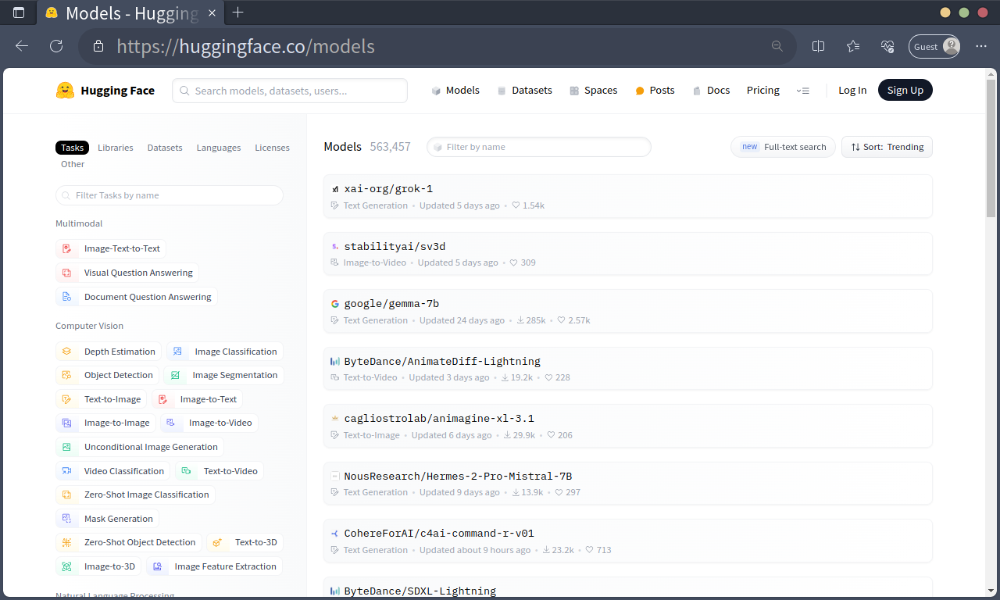
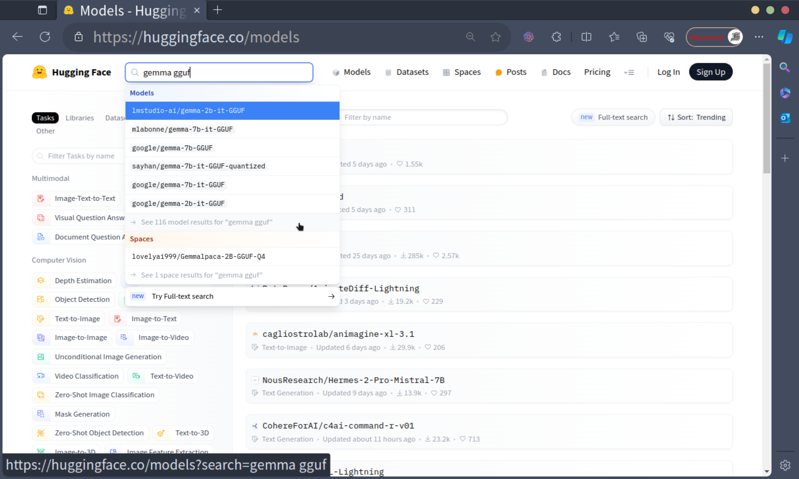
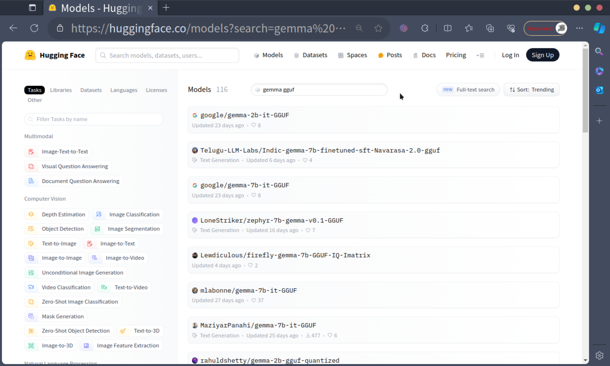
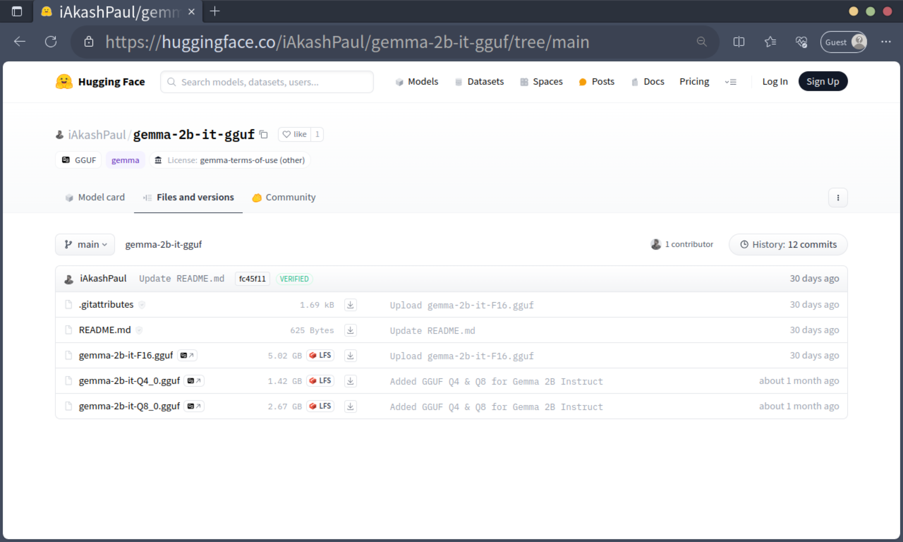

# How to Get Quantized GGUF Models

This guide provides step-by-step instructions for obtaining GGUF-formatted models that are compatible with the LLAMA2, such as the Gemma and TinyLlama series. These models can be employed for the development, usage, and evaluation of crabml.

We will explore how to find models on the platforms like Hugging Face and detail the quantization process using [llama.cpp](https://github.com/ggerganov/llama.cpp).

## Obtaining Models from Community Platforms

Platforms like [Hugging Face](https://huggingface.co/) allow users to upload and share their models. You can find the models you need by using the search tools provided on these platforms.

### How to Search for Models on Hugging Face

1. Navigate to [Hugging Face Models](https://huggingface.co/models).

   

2. Type your keywords, such as `gemma gguf`, into the search bar.

   

3. Review the list of models that meet your search criteria.

   

4. Choose a model to see more details and download the necessary files from the "Files and versions" tab.

   

## Quantifying with llama.cpp

To convert models to the GGUF format or apply specific quantization parameters, llama.cpp can be used.

### Compiling llama.cpp

Execute the following steps to compile llama.cpp:

1. Clone the llama.cpp repository to your local machine.

   ```sh
   git clone https://github.com/ggerganov/llama.cpp.git
   cd llama.cpp
   ```

2. (Optional) If you wish to exclude k-quantization, set an environment variable before compiling.

   ```sh
   export LLAMA_NO_K_QUANTS=1
   ```

3. Compile the source code to create the executables:

   ```sh
   make -j
   ```

4. Verify the presence of the `quantize` executable:

   ```bash
   ❯ ls | grep 'quantize'
   .rwxr-xr-x 1.4M psiace 24 Mar 10:09 quantize
   .rwxr-xr-x 1.5M psiace 24 Mar 10:09 quantize-stats
   ```

### Quantifying the Model

To quantify your model using llama.cpp, proceed with the following:

1. (Optional) Convert non-GGUF models with convert.py:

   ```bash
   # Make sure you have git-lfs installed (https://git-lfs.com)
   git lfs install
   # Replace `<repo>` with something like `PY007/TinyLlama-1.1B-Chat-v0.3`.
   # Replace `<model>` with local path.
   git clone https://huggingface.co/<repo> <model>
   # Replace `<outtype>` with {f32,f16,q8_0}, but requantizing from type q8_0 is disabled
   python3 convert.py <model> --outfile <model>-<outtype>.gguf  --outtype <outtype>
   ```

2. Prepare your gguf model file (e.g., `<model>-<outtype>.gguf`).
3. Quantize the model using the `quantize` executable:

   ```bash
   # Replace `<type>` with target type
   ./quantize <model>-f16.gguf <model>-<type>.gguf <type>
   ```

4. After the process is complete, you will have a quantized GGUF model file.

Always refer to the most recent llama.cpp documentation for updated commands and usage.

## Conclusion

This document has guided you through obtaining GGUF-formatted models from Hugging Face and quantizing them with the llama.cpp tool. For further assistance, consult the provided documentation on each platform or contact the model contributors.
